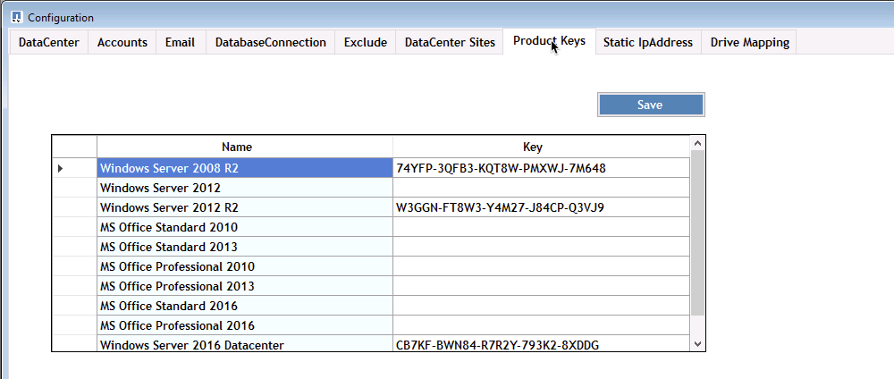

= 概述

== 概述

DCConfig 是 CVMGER1 VM 上的一个配置实用程序，用于设置和更改许多部署范围的设置。

. 以管理员身份连接到 CVMGER1 虚拟机
. 从桌面快捷方式运行应用程序

应用程序中有三个主要部分：配置，高级和帮助。

=== 配置

" 配置 " 窗口在启动时打开，其中包含多个子部分

==== 数据中心

image::images/Management.dcconfig.dcconfig.overview-61c8f.png[management.dcconfig.dcconfig.overview 61c8f]

==== —帐户

image::images/Management.dcconfig.dcconfig.overview-f34a2.png[management.dcconfig.dcconfig.overview f34a2.]

==== email

image::images/Management.dcconfig.dcconfig.overview-4b3be.png[management.dcconfig.dcconfig.overview 4b3be]

==== 数据连接

image::images/Management.dcconfig.dcconfig.overview-80da7.png[management.dcconfig.dcconfig.overview 80da7.]

==== 排除

image::images/Management.dcconfig.dcconfig.overview-0f30e.png[management.dcconfig.dcconfig.overview 0f30e]

==== 数据中心站点

image::images/Management.dcconfig.dcconfig.overview-95b21.png[management.dcconfig.dcconfig.overview 95b21]

==== 产品密钥

==== 静态 IP 地址

image::images/Management.dcconfig.dcconfig.overview-7e4a4.png[management.dcconfig.dcconfig.overview 7e4a4.]

==== 驱动器映射

image::images/Management.dcconfig.dcconfig.overview-60fd2.png[management.dcconfig.dcconfig.overview 60fd2.]

=== 高级

" 高级 " 窗口将显示一个值列表，您可以在此界面中编辑这些值。

[cols="33,33,33"]
|===
| 组名称 | 友情名称 | 价值 

| 组名称 | 友情名称 | 价值 

| 服务器创建 | UpdateVMNameWhenRemovedFromCache | 判断对错 

| 服务器创建 | UpdateFirewallRules. | 判断对错 

| 服务器创建 | WaitAfterRebootMin | <# minutes> 

| 服务器创建 | WaitAfterHypervisorCreateMin | <# minutes> 

| 服务器创建 | WaitAfterSysPreparMin | <# minutes> 

| 服务器创建 | WaitAfterSysPreparFor2008ServersMin | <# minutes> 

| 服务器创建 | GFI 代理路径 |  

| 服务器创建 | 已启用自动克隆 | 判断对错 

| 服务器创建 | 公司 OU | <String - Companines OU Name> 

| 服务器创建 | 安装 ThinPrint v11 | 判断对错 

| 服务器创建 | ServersOU | <String - 服务器 OU 名称 > 

| 服务器创建 | 安装 FsLogix | 判断对错 

| 服务器创建 | 使用默认 OU | 判断对错 

| 服务器创建 | 最大线程数 | <#> 

| 服务器创建 | 等待 DNS 更新分钟 | <# minutes> 

| 检查 V 直流工具版本 | 每 X 分钟运行一次 | <# minutes> 

| 每日操作 | enabled | 判断对错 

| 每日操作 | 启动时运行 | 判断对错 

| 生成报告 | 时间 | < 时间 00 ： 00> 

| 日常维护 | enabled | 判断对错 

| 日常维护 | 时间 | < 时间 00 ： 00> 

| 每周维护 | enabled | 判断对错 

| 每周维护 | 时间 | < 时间 00 ： 00> 

| 每周维护 | day | < 一周中的某一天 > 

| 自动资源 Allocation | enabled | 判断对错 

| 资源分配 | 使用数据中心默认值 | 判断对错 

| 电子邮件报告 | IncluseEmailAttachment | 判断对错 

| 服务器检测信号 | 间隔分钟数 | <# minutes> 

| 下载 AutoPro 数据 | 间隔分钟数 | <# minutes> 

| 数据中心检测信号 | 间隔分钟数 | <# minutes> 

| 服务器重新启动 | enabled | 判断对错 

| 服务器重新启动 | 重新启动之间的延迟分钟 | <# minutes> 

| FreeSpaceReport | 最小 FreeSpaceGB | < 最小 GB 阈值 > 

| 最大重新启动时间间隔 | 客户端服务器 | < 需要重新启动前 # 小时 > 

| 最大重新启动时间间隔 | 基础架构服务器 | < 需要重新启动前 # 小时 > 

| 自动更新 VDC 工具 | enabled | 判断对错 

| ActivateOffice | enabled | 判断对错 

| ActivateWindows | enabled | 判断对错 

| 监控 | 最长保留天数 | <# days> 

| 日志 | 最长保留天数 | <# days> 

| 报告数据 | 最长保留天数 | <# days> 

| 文件审核 | 最长保留天数 | <# days> 

| 文件审核 | 详细日志记录 | 判断对错 

| 文件审核文件夹 | 数字文件夹 | 2. 

| 文件审核文件夹 1. | 路径 | 数据驱动器： \Data 

| 文件审核文件夹 1. | 排除 | * Thumbs.db 

| 文件审核文件夹 1. | 排除 | * 。 tmp 

| 文件审核文件夹 1. | 排除 | *~ $* 。 doc 

| 文件审核文件夹 1. | 排除 | *~ $* 。 docx 

| 文件审核文件夹 2. | 路径 | DataDrive] ： \Home 

| 文件审核文件夹 2. | 排除 | thumbs.db 

| CwVmAutomationService | 服务命令行参数 |  

| FtpReleaAddress | URL | <FTP URL> 

| 工作负载计划 | 每 X 分钟运行一次 | <# minutes> 

| 工作负载计划 | 关闭缓存公司 | 判断对错 

| 创建备份 | enabled | 判断对错 

| 创建备份 | 每 X 分钟运行一次 | <# minutes> 

| 监控应用程序 | enabled | 判断对错 

| 笔 | InitialSepSeconds | <# seconds> 

| 笔 | 《 MustChangePasswordDay 》 | < 强制 PW 重置的到期前 # 天 > 

|  |  | < 密码重置文本字符串 > 

| 笔 | 标识 | <local .png logo path> 

| 笔 | NumNotifyDays | <# days> 

| 笔 | 通知第 1 天 | < 到期前的 # 天以通知 > 

| 笔 | 通知第 2 天 | < 到期前的 # 天以通知 > 

| 笔 | 通知第 3 天 | < 到期前的 # 天以通知 > 

| 笔 | 通知第 4 天 | < 到期前的 # 天以通知 > 

| 笔 | 通知第 5 天 | < 到期前的 # 天以通知 > 

| 笔 | 通知第 6 天 | < 到期前的 # 天以通知 > 

| 监控 | enabled | 判断对错 

| 监控 | 发送电子邮件警报 | 判断对错 

| 监控 | 警报服务器关闭几分钟 | <# minutes> 

| 监控 | 将 RAM 高警报数分钟 | <# minutes> 

| 监控 | RAM 高 % | < RAM % 阈值 > 

| 监控 | 警告 CPU 高数分钟 | <# minutes> 

| 监控 | CPU 高 % | <CPU % Threster> 

| 监控 | 驱动器空间不足百分比 | < 磁盘空间可用 % 阈值 > 

| 删除客户端延迟 | minutes | <# minutes> 

| 自动扩展驱动器 | enabled | 判断对错 

| 安全强化 | enabled | 判断对错 

| 以域管理员身份运行 CwAgent | enabled | 判断对错 

| 监控服务器 | 使用 SolarWinds | 判断对错 

| 自动更新 H5 门户 | enabled | 判断对错 

| 安装通配符证书 | 在基础架构服务器上 | 判断对错 

| 创建公司 | 在唯一站点中 | 判断对错 

| 实时扩展 | 延迟关闭最小值 | <# minutes> 

| 服务器资源报告 | 检查 DNS | 判断对错 

| 虚拟机管理程序 | 缓存模板 | 判断对错 

| 详细日志记录 | 实时扩展 | 判断对错 

| 详细日志记录 | 实时扩展—显示服务器状态 | 判断对错 

| 详细日志记录 | 工作负载计划 | 判断对错 

| 详细日志记录 | 使用模板创建服务器 | 判断对错 

| 详细日志记录 | 使用模板计时创建服务器 | 判断对错 

| 详细日志记录 | 从备份创建服务器 | 判断对错 

| 详细日志记录 | 从克隆创建服务器 | 判断对错 

| 详细日志记录 | 创建模板 | 判断对错 

| 详细日志记录 | 与其他服务通信 | 判断对错 

| 创建模板 | 手动运行 SysPrep | 判断对错 

| 域控制器 | Name | cwmgr1.<domain.com 
|===
image::images/Management.dcconfig.dcconfig.overview-9c7ac.png[management.dcconfig.dcconfig.overview 9c7ac]

=== 帮助

打开本地帮助文件。
